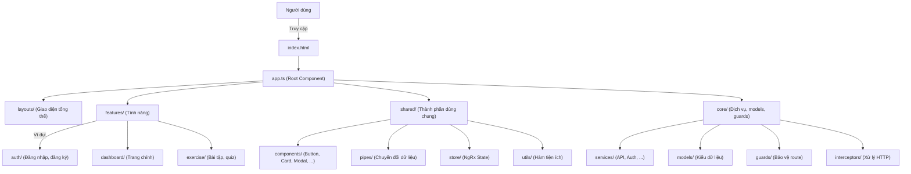

# CodeCampus Frontend
Đây là phần frontend của dự án CodeCampus, được xây dựng bằng Angular framework.

## Tổng quan bài toán
CodeCampus là một nền tảng trực tuyến được thiết kế để học lập trình. Nền tảng hỗ trợ nhiều vai trò như học sinh, giáo viên, phụ huynh, quản trị viên và tổ chức (trường học/tổ chức). Các tính năng bao gồm xác thực người dùng, quản lý hồ sơ, diễn đàn thảo luận, nộp bài tập và bài thi, đánh giá, tài nguyên học tập, thanh toán, thông báo và tích hợp AI.

### Mục tiêu chính
- Cung cấp các bài tập lập trình tương tác với phản hồi thời gian thực.
- Thúc đẩy thảo luận cộng đồng qua diễn đàn công khai và riêng tư.
- Hỗ trợ giáo viên tạo và quản lý bài tập, bài thi và tài nguyên.
- Hỗ trợ các tính năng cao cấp qua đăng ký và tiền ảo.
- Tích hợp AI để đề xuất, đánh giá và kiểm duyệt nội dung.
- Đảm bảo xác thực an toàn và bảo mật dữ liệu.

## Các vai trò
- Là học sinh: Đăng ký, duyệt bài tập, nộp mã nguồn, tham gia diễn đàn.
- Là giáo viên: Tạo bài tập, theo dõi tiến độ, kiểm duyệt nội dung.
- Là quản trị viên: Quản lý người dùng, xem báo cáo, cấu hình hệ thống.

## Tính năng
### 1. Quản lí Xác thực và Phân quyền
- Đăng ký người dùng qua Google/Facebook hoặc email/mật khẩu.
- Xác minh email bằng OTP.
- Đăng nhập cho người dùng, quản trị viên và tổ chức.
- Đặt lại mật khẩu, khóa/mở khóa tài khoản bởi quản trị viên.
- Chức năng đăng xuất.

### 2. Quản lý Người dùng
- Cập nhật thông tin hồ sơ cá nhân.
- Lưu/yêu thích bài tập.
- Xem tiến độ học tập (bài tập đã hoàn thành, điểm số, biểu đồ).
- Thông báo về các cột mốc.
- Role giáo viên: Quản lý lớp học, bài tập đã tạo.
- Liên kết phụ huynh để theo dõi tiến độ của con.
- Tương tác xã hội: Theo dõi/chặn người dùng, xem hồ sơ người khác.

### 3. Quản lí Diễn đàn
- Tạo bài viết/chủ đề trong diễn đàn công khai hoặc nội bộ tổ chức.
- Bình luận, thích/không thích, đính kèm tệp (mã nguồn, hình ảnh).
- Tìm kiếm bài viết theo từ khóa, thẻ, bộ lọc.
- AI đề xuất bài viết liên quan.
- Kiểm duyệt: Xóa/sửa bài viết/bình luận bởi quản trị viên/giáo viên.
- Thông báo cho phản hồi, lượt thích, bài viết mới.

### 4. Quản lý Tổ chức
- Tạo tổ chức với logo, mô tả, và các thông tin liên quan khác.
- Thêm thành viên thủ công hoặc qua nhập Excel.
- Diễn đàn nội bộ với kiểm duyệt AI.
- Báo cáo vi phạm, bình luận thời gian thực.
- Bảng điều khiển cho thống kê hoạt động.
- Nhật ký kiểm tra và giới hạn tốc độ cho API.

### 5. Quản lí Nộp bài tập, thi cử & Đánh giá 
- Tạo bài kiểm tra/bài tập mã nguồn với câu hỏi do AI tạo.
- Tìm kiếm/lọc bài tập theo độ khó, chủ đề.
- Nộp mã nguồn, chạy thử nghiệm thời gian thực (hỗ trợ C, C++, Java, Python, v.v.).
- Xem lịch sử nộp bài, điểm số, phản hồi AI về lỗi/khoảng trống kiến thức.
- Công cụ giáo viên: Thêm test case, đặt thời gian, chống gian lận, báo cáo hiệu suất học sinh.
- Xếp hạng, phần thưởng dựa trên điểm số/vị trí.
- Phân tích phong cách mã nguồn bằng AI, phát hiện mã độc.

### 6. Quản lí Tài nguyên Học tập 
- Quản lý/tải lên tài liệu/video (hỗ trợ chuyển mã).
- Phân loại theo chủ đề/mức độ.
- Công cụ học sinh: Tìm kiếm, tạo danh sách phát, mua bằng điểm/tiền.
- Theo dõi tiến độ, thông báo về tài nguyên mới.
- Code Playground: Trình chỉnh sửa giống IDE với kiểm soát phiên bản.

### 7. Quản lí Thanh toán 
- Đăng ký gói cao cấp.
- Tạo/phân phối phiếu giảm giá.
- Hủy đăng ký với hoàn tiền theo tỷ lệ.
- Nạp tiền ảo.
- CAPTCHA để ngăn chặn gian lận.
- Báo cáo doanh thu cho quản trị viên.

### 8. Quản lí Đánh giá 
- Báo cáo PDF hàng tháng cho phụ huynh.
- AI dự đoán tỷ lệ hoàn thành khóa học.
- Lộ trình học tập cá nhân hóa.
- So sánh trung bình lớp học.

### 9. Quản lí Thông báo 
- Thông báo qua email/SMS/push cho bài viết mới, bài tập, thanh toán.
- Tùy chỉnh tùy chọn thông báo.
- Nhắc nhở 24 giờ trước hạn chót.
- Thông báo hàng loạt cho tổ chức.

### 10. Quản lí Tìm kiếm 
- Tìm kiếm được lưu vào bộ nhớ cache (sử dụng Redis) cho bài viết diễn đàn.

### 11. Tích hợp AI
- API Gemini để đề xuất câu hỏi, dịch thuật, tóm tắt.
- Phân tích khoảng trống kiến thức, phát hiện spam.

### 12. Cơ sở hạ tầng
- CI/CD với GitHub Actions.
- Giám sát qua Grafana/Prometheus.
- Yêu cầu phi chức năng: Bảo mật dữ liệu, hiệu suất, khả năng mở rộng.

## Công nghệ sử dụng toàn bộ hệ thống
- Backend: Microservices (Java/Spring Boot, C#/.NET Core Web API).
- Frontend: Angular 19.2.14, NgRx, TypeScript, RxJS, Angular CLI
- Cơ sở dữ liệu: Neo4j, PostgreSQL, MongoDB, MS SQL Server.
- AI: Google Gemini API, mô hình NLP để phát hiện spam.
- Bộ nhớ cache: Redis.
- Giám sát: Grafana, Prometheus.
- Triển khai: Docker, Kubernetes, GitHub Actions cho CI/CD.
- Ngôn ngữ cho bài tập mã nguồn: C, C++, Java, Python, JavaScript, SQL (với thực thi trong môi trường sandbox).

## Công nghệ sử dụng frontend
- **Angular 19.2.14**: Framework chính để xây dựng ứng dụng
- **NgRx**: State management (Store, Effects, DevTools)
- **TypeScript**: Ngôn ngữ lập trình chính
- **RxJS**: Xử lý bất đồng bộ và reactive programming
- **Angular CLI**: Công cụ để phát triển và build ứng dụng

## Yêu cầu hệ thống
- Node.js (phiên bản LTS mới nhất)
- npm (được cài đặt cùng với Node.js)
- Angular CLI (phiên bản 20.2.1)

## Cấu trúc dự án (Tổng quan & Minh họa)

```
frontend/
├── src/
│   ├── app/
│   │   ├── core/         # Thành phần cốt lõi, dịch vụ dùng chung, models, guards, interceptors
│   │   ├── features/     # Các module tính năng (auth, dashboard, exercise, ...)
│   │   ├── layouts/      # Các layout tổng thể (header, menu, modal, ...)
│   │   ├── shared/       # Thành phần dùng chung (components, pipes, store, utils)
│   │   ├── styles/       # Style và theme toàn cục
│   │   ├── app.routes.ts # Định nghĩa route tổng
│   │   ├── app.config.ts # Cấu hình ứng dụng
│   │   └── app.ts        # Root component
│   ├── environments/     # Cấu hình môi trường (dev, prod)
│   ├── index.html        # HTML entry point
│   └── styles.scss       # Global style entry
├── public/               # Tài nguyên tĩnh (ảnh, icon, ...)
├── cấu hình & tài liệu   # angular.json, package.json, README.md, ...
```

## Design Patterns Áp Dụng Trong Dự Án

Dự án Angular này áp dụng nhiều **design pattern chuẩn** để đảm bảo code rõ ràng, maintainable và dễ mở rộng. Tổng quan:

---

### 1. Module Pattern
- Chia dự án theo **feature module** (`auth`, `dashboard`, `organization`, `post`, `profile`, ...).
- Mỗi module chứa component, service và routing riêng, giúp tổ chức code gọn gàng.

### 2. Singleton Pattern
- Các service trong `core/services` được cung cấp thông qua Angular DI (`providedIn: 'root'`), đảm bảo **chỉ tồn tại 1 instance duy nhất** trong ứng dụng.

### 3. Observer Pattern
- Sử dụng **RxJS Observables/Subjects** để quản lý luồng dữ liệu và state.
- Áp dụng trong **NgRx store**, HTTP requests, và các event giữa component.

### 4. Interceptor Pattern
- Các HTTP interceptor trong `core/interceptors` quản lý request/response chung: **logging, error handling, authentication token**.

### 5. Strategy Pattern
- **Guards** (`AuthGuard`, `RoleGuard`) áp dụng strategy để quyết định quyền truy cập.
- **Environments** (`dev`, `staging`, `prod`) chọn cấu hình phù hợp theo môi trường.

### 6. Facade Pattern
- **Router Manager** gom logic routing vào 1 chỗ.
- **NgRx Facade** (nếu sử dụng) để tách component khỏi chi tiết state management.

### 7. Template Pattern
- Các **layout** (`header`, `sidebar`, `footer`) định nghĩa khung sẵn, feature module nhúng nội dung vào khu vực content.

### 8. Smart & Dumb Components (Container/Presenter)
- Component **Smart** xử lý logic, data fetching, và state.
- Component **Dumb** nhận `@Input()` và emit `@Output()`, chỉ chịu trách nhiệm hiển thị.

### 9. Decorator Pattern
- Angular decorators: `@Component`, `@Directive`, `@Pipe`, `@Injectable`.
- Cho phép mở rộng chức năng mà không sửa code gốc.

### 10. DTO Pattern
- Các **model** trong `core/models` quản lý dữ liệu giữa API và component, đảm bảo type safety.

---

**Lợi ích:**  
- Code dễ maintain, tái sử dụng cao.  
- Tách biệt rõ ràng giữa logic và UI.  
- Chuẩn hóa cách tổ chức dự án theo Angular best practices.  


### Minh họa luồng hoạt động



### Mô tả tổng quan frontend

- **core/**: Chứa các thành phần cốt lõi như dịch vụ (services), kiểu dữ liệu (models), bảo vệ route (guards), và interceptors cho HTTP.
- **features/**: Mỗi tính năng lớn của ứng dụng (auth, dashboard, exercise, ...) là một module riêng biệt, dễ mở rộng và bảo trì.
- **layouts/**: Định nghĩa các layout tổng thể như header, menu, modal, giúp tái sử dụng giao diện.
- **shared/**: Các thành phần dùng chung trên toàn ứng dụng như button, card, pipes, store (NgRx), và các hàm tiện ích.
- **styles/**: Quản lý style, theme, font cho toàn bộ ứng dụng.
- **environments/**: Cấu hình môi trường (dev, prod) để dễ dàng chuyển đổi khi deploy.
- **public/**: Lưu trữ tài nguyên tĩnh như ảnh, icon, logo.

> **Luồng hoạt động:**  
Người dùng truy cập vào ứng dụng qua `index.html`, Angular khởi tạo `app.ts` (root component), sau đó điều phối đến các layout, module tính năng (features), và sử dụng các thành phần dùng chung (shared) cũng như các dịch vụ cốt lõi (core).

### Chi tiết các module chính

#### Core Module
- **Services**: Chứa các service cốt lõi như authentication, API calls, error handling
- **Models**: Định nghĩa các interface và type cho dữ liệu
- **Interceptors**: HTTP interceptors cho xử lý requests/responses
- **Constants**: Các hằng số và enum được sử dụng trong toàn bộ ứng dụng

#### Features Module
- **Auth**: Module xử lý authentication và authorization
  - Login/Register components
  - Auth guards
  - Auth services
- **Dashboard**: Module chính của ứng dụng
  - Dashboard components
  - Feature-specific services
  - Feature-specific models

#### Shared Module
- **Components**: Các component có thể tái sử dụng
  - UI components (buttons, cards, modals)
  - Form components
  - Layout components
- **Utils**: Các utility functions và helpers
- **Store**: NgRx store configurations
  - Actions
  - Reducers
  - Effects
  - Selectors
- **Pipes**: Custom pipes cho data transformation

#### Layouts
- Header component
- Footer component
- Sidebar component
- Main layout template

## Hướng dẫn cài đặt

1. Clone repository:
```bash
git clone [repository-url]
cd frontend
```

2. Cài đặt dependencies:
```bash
npm install
```

3. Tạo file môi trường:
- Copy file `src/environments/environment.example.ts` thành `src/environments/environment.ts`
- Cập nhật các biến môi trường trong file `environment.ts`

4. Chạy ứng dụng ở môi trường development:
```bash
npm start
```
Ứng dụng sẽ chạy tại `http://localhost:4200`

## Các lệnh thường dùng

- `npm start`: Chạy ứng dụng ở môi trường development
- `npm run build`: Build ứng dụng cho production
- `npm run watch`: Build và watch mode cho development

## Cấu trúc State Management (NgRx)

Dự án sử dụng NgRx để quản lý state với các thành phần:
- Store: Lưu trữ state
- Effects: Xử lý side effects
- DevTools: Debug và theo dõi state changes

## Development Guidelines

1. **Code Style**
   - Tuân thủ Angular Style Guide
   - Sử dụng TypeScript strict mode
   - Follow ESLint rules

2. **Git Workflow**
   - Sử dụng feature branches
   - Commit messages rõ ràng và có ý nghĩa
   - Code review trước khi merge

3. **Testing**
   - Unit tests cho services và components
   - E2E tests cho critical paths
   - Maintain test coverage

## Deployment

1. Build ứng dụng:
```bash
npm run build
```

2. Output sẽ được tạo trong thư mục `dist/`

## Contributing

1. Fork repository
2. Tạo feature branch
3. Commit changes
4. Push to branch
5. Tạo Pull Request

## Contact

Toquangduc2004@gmail.com

