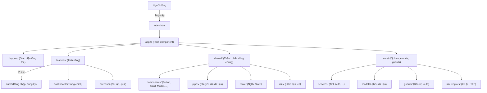

# CodeCampus Frontend

Đây là phần frontend của dự án CodeCampus, được xây dựng bằng Angular framework.

## Công nghệ sử dụng

- **Angular 19.2.14**: Framework chính để xây dựng ứng dụng
- **NgRx**: State management (Store, Effects, DevTools)
- **TypeScript**: Ngôn ngữ lập trình chính
- **RxJS**: Xử lý bất đồng bộ và reactive programming
- **Angular CLI**: Công cụ để phát triển và build ứng dụng

## Yêu cầu hệ thống

- Node.js (phiên bản LTS mới nhất)
- npm (được cài đặt cùng với Node.js)
- Angular CLI (phiên bản 19+)

## Cấu trúc dự án (Tổng quan & Minh họa)

```
frontend/
├── src/
│   ├── app/
│   │   ├── core/         # Thành phần cốt lõi, dịch vụ dùng chung, models, guards, interceptors
│   │   ├── features/     # Các module tính năng (auth, dashboard, exercise, ...)
│   │   ├── layouts/      # Các layout tổng thể (header, menu, modal, ...)
│   │   ├── shared/       # Thành phần dùng chung (components, pipes, store, utils)
│   │   ├── styles/       # Style và theme toàn cục
│   │   ├── app.routes.ts # Định nghĩa route tổng
│   │   ├── app.config.ts # Cấu hình ứng dụng
│   │   └── app.ts        # Root component
│   ├── environments/     # Cấu hình môi trường (dev, prod)
│   ├── index.html        # HTML entry point
│   └── styles.scss       # Global style entry
├── public/               # Tài nguyên tĩnh (ảnh, icon, ...)
├── cấu hình & tài liệu   # angular.json, package.json, README.md, ...
```

### Minh họa luồng hoạt động



### Mô tả tổng quan

- **core/**: Chứa các thành phần cốt lõi như dịch vụ (services), kiểu dữ liệu (models), bảo vệ route (guards), và interceptors cho HTTP.
- **features/**: Mỗi tính năng lớn của ứng dụng (auth, dashboard, exercise, ...) là một module riêng biệt, dễ mở rộng và bảo trì.
- **layouts/**: Định nghĩa các layout tổng thể như header, menu, modal, giúp tái sử dụng giao diện.
- **shared/**: Các thành phần dùng chung trên toàn ứng dụng như button, card, pipes, store (NgRx), và các hàm tiện ích.
- **styles/**: Quản lý style, theme, font cho toàn bộ ứng dụng.
- **environments/**: Cấu hình môi trường (dev, prod) để dễ dàng chuyển đổi khi deploy.
- **public/**: Lưu trữ tài nguyên tĩnh như ảnh, icon, logo.

> **Luồng hoạt động:**  
Người dùng truy cập vào ứng dụng qua `index.html`, Angular khởi tạo `app.ts` (root component), sau đó điều phối đến các layout, module tính năng (features), và sử dụng các thành phần dùng chung (shared) cũng như các dịch vụ cốt lõi (core).

### Chi tiết các module chính

#### Core Module
- **Services**: Chứa các service cốt lõi như authentication, API calls, error handling
- **Models**: Định nghĩa các interface và type cho dữ liệu
- **Interceptors**: HTTP interceptors cho xử lý requests/responses
- **Constants**: Các hằng số và enum được sử dụng trong toàn bộ ứng dụng

#### Features Module
- **Auth**: Module xử lý authentication và authorization
  - Login/Register components
  - Auth guards
  - Auth services
- **Dashboard**: Module chính của ứng dụng
  - Dashboard components
  - Feature-specific services
  - Feature-specific models

#### Shared Module
- **Components**: Các component có thể tái sử dụng
  - UI components (buttons, cards, modals)
  - Form components
  - Layout components
- **Utils**: Các utility functions và helpers
- **Store**: NgRx store configurations
  - Actions
  - Reducers
  - Effects
  - Selectors
- **Pipes**: Custom pipes cho data transformation

#### Layouts
- Header component
- Footer component
- Sidebar component
- Main layout template

## Hướng dẫn cài đặt

1. Clone repository:
```bash
git clone [repository-url]
cd frontend
```

2. Cài đặt dependencies:
```bash
npm install
```

3. Tạo file môi trường:
- Copy file `src/environments/environment.example.ts` thành `src/environments/environment.ts`
- Cập nhật các biến môi trường trong file `environment.ts`

4. Chạy ứng dụng ở môi trường development:
```bash
npm start
```
Ứng dụng sẽ chạy tại `http://localhost:4200`

## Các lệnh thường dùng

- `npm start`: Chạy ứng dụng ở môi trường development
- `npm run build`: Build ứng dụng cho production
- `npm run watch`: Build và watch mode cho development

## Cấu trúc State Management (NgRx)

Dự án sử dụng NgRx để quản lý state với các thành phần:
- Store: Lưu trữ state
- Effects: Xử lý side effects
- DevTools: Debug và theo dõi state changes

## Development Guidelines

1. **Code Style**
   - Tuân thủ Angular Style Guide
   - Sử dụng TypeScript strict mode
   - Follow ESLint rules

2. **Git Workflow**
   - Sử dụng feature branches
   - Commit messages rõ ràng và có ý nghĩa
   - Code review trước khi merge

3. **Testing**
   - Unit tests cho services và components
   - E2E tests cho critical paths
   - Maintain test coverage

## Deployment

1. Build ứng dụng:
```bash
npm run build
```

2. Output sẽ được tạo trong thư mục `dist/`

## Contributing

1. Fork repository
2. Tạo feature branch
3. Commit changes
4. Push to branch
5. Tạo Pull Request

## Contact

Toquangduc2004@gmail.com

